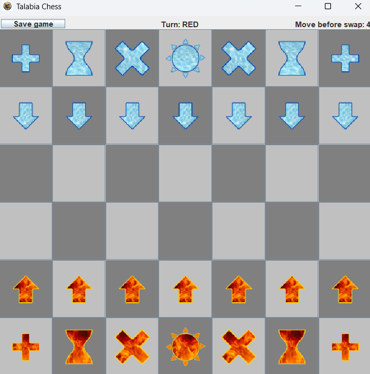

# Talabia Chess ♟️



A Java-based chess application featuring traditional chess rules with a clean graphical interface.

## Requirements

- Java SDK 11 or later installed
- Minimum screen resolution: 1024×768

## Installation & Running

1. **Download** the latest `Talabia-Chess.jar` from [Releases](https://github.com/MohamedImran7868/Talabia-Chess/releases)
2. **Run** the game using:
   ```bash
   java -jar Talabia-Chess.jar

## Features
1. Standard chess rules implementation
2. Graphical board with piece movement
3. Turn-based gameplay
4. Move validation
5. Win/lose detection
